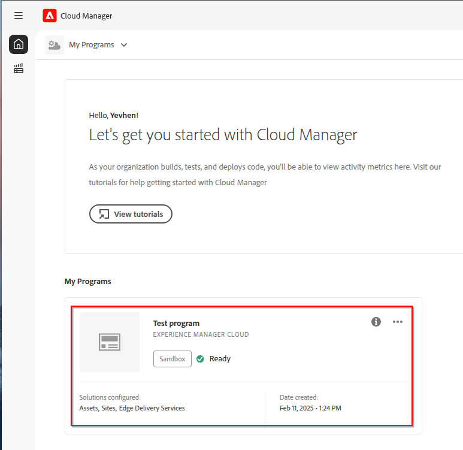
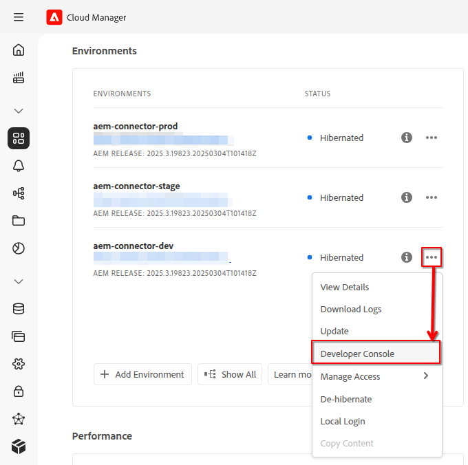
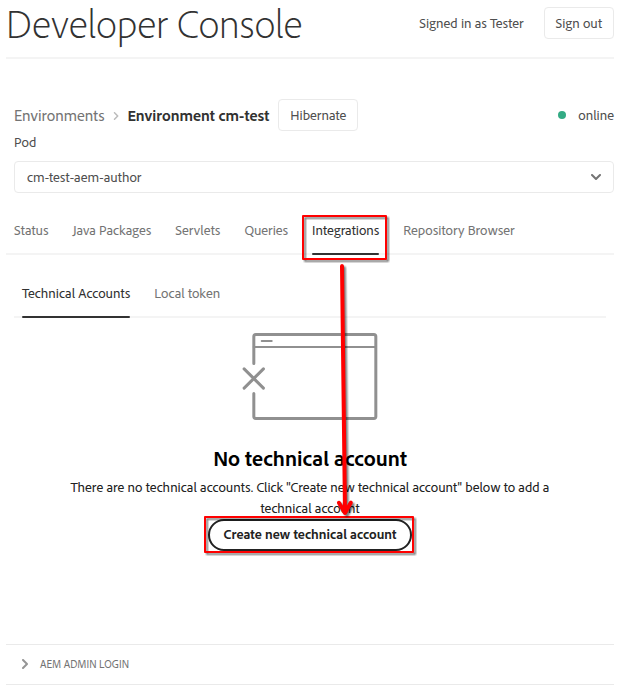
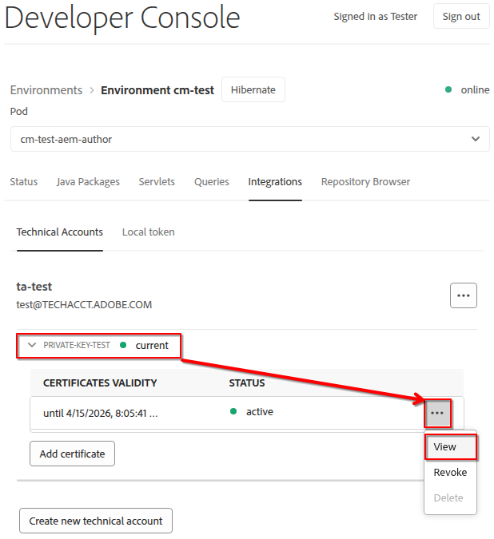
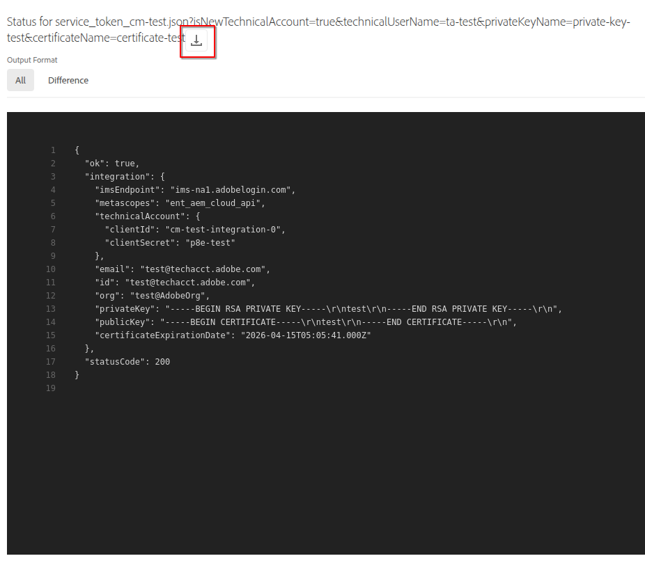
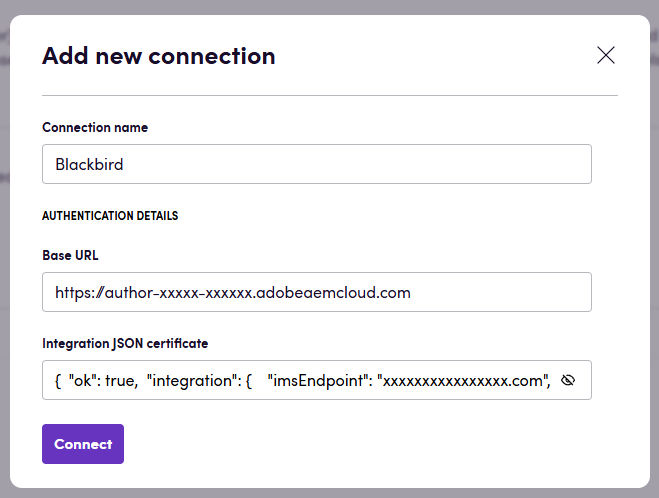

# Blackbird.io AEM

Blackbird is the new automation backbone for the language technology industry. Blackbird provides enterprise-scale automation and orchestration with a simple no-code/low-code platform. Blackbird enables ambitious organizations to identify, vet and automate as many processes as possible. Not just localization workflows, but any business and IT process. This repository represents an application that is deployable on Blackbird and usable inside the workflow editor.

## Introduction

<!-- begin docs -->

AEM (Adobe Experience Manager) is a Content Management System (CMS) that allows users and companies to easily build websites, apps, and manage web pages and content. AEM is used by developers and marketers to organize and distribute content across digital channels.

## Before setting up

Before you connect to AEM, you need to have the following:

- AEM instance running and accessible from the Blackbird platform.
- You have a technical account and created a private key for it so you can obtain a certificate to connect to AEM. Below in the `Steps to create technical account` section, you can find the steps to create a technical account and a private key and how to obtain a certificate.
- You know your base URL for AEM environment. The base URL is the URL of your AEM instance, e.g. `https://author-xxxx-xxxxx.adobeaemcloud.com`.

## Steps to create technical account

1. Open [Cloud Manager](https://experience.adobe.com/cloud-manager/landing.html).
2. Select needed program. 

3. Open Developer Console for needed Author environment. 

4. Switch to `Integrations` tab and `Create new technical account`. 

5. Unfold created private key and `View` the data. 

6. Use the `Download` button to obtain the raw data and store it in a file or another location from which it will be used for integration. 

## Install the plugin for AEM

Detailed instructions on how to install the plugin can be found in the [AEM plugin repository](https://github.com/bb-io/AEM).

## Connecting

1. Navigate to apps and search for **AEM**
2. Click _Add Connection_
3. Name your connection for future reference e.g., 'My AEM'
4. Fill in the following fields:
   - **Base URL**: Your AEM base URL (e.g., `https://author-xxxx-xxxxx.adobeaemcloud.com`)
   - **Integration JSON certificate**: Integration certificate in JSON format. Can be found in the Developer Console. Example: { "ok": true, "integration": { "imsEndpoint": "ims-na1.adobelogin.com", ... } "statusCode": 200}
5. Click _Connect_
6. Confirm that the connection has appeared and the status is _Connected_

## Actions

### Pages

- **Search pages**: Search for pages based on provided criteria.
- **Get page as HTML**: Get the HTML content of a page.
- **Update page from HTML**: Update a page using HTML content.

## Events

- **On pages created or updated**: Polling event that periodically checks for new or updated pages. If the any pages are found, the event is triggered.

## Feedback

Do you want to use this app or do you have feedback on our implementation? Reach out to us using the [established channels](https://www.blackbird.io/) or create an issue.

<!-- end docs -->
